# Crest Foundry

A browser-based club crest creator for designing custom badges for any club — football/soccer, scholastic, recreational, intramural, social, role-playing, and more. Combine shield shapes, heraldic symbols, background patterns, text, and borders — then save your work to the cloud, share it with a link, or export it as a PNG/SVG.

> **Forge Your Club's Legacy.** Live at [crest-foundry.jasonmharrison.info](https://crest-foundry.jasonmharrison.info/)

---

## Screenshots

<table>
  <tr>
    <td align="center"><br/><sub>Flamingo · diagonal stripes</sub></td>
    <td align="center"><br/><sub>Unicorn · free crown above badge</sub></td>
    <td align="center"><br/><sub>Star burst · sash · fabric bg</sub></td>
    <td align="center"><br/><sub>Spade · crown · checkered · brick bg</sub></td>
  </tr>
  <tr>
    <td align="center"><br/><sub>Diamond · free star above</sub></td>
    <td align="center"><br/><sub>AAC · pennant · fabric bg</sub></td>
    <td align="center"><br/><sub>Spartan · sun burst · stadium bg</sub></td>
    <td align="center"><br/><sub>Swallow · circular · arc text · grass bg</sub></td>
  </tr>
  <tr>
    <td align="center"><br/><sub>Angel emblem · checkered · gold border · arc text</sub></td>
    <td align="center"><br/><sub>Griffin · diagonal split · star</sub></td>
    <td align="center"><br/><sub>Tree of life · diagonal stripes · gold border</sub></td>
  </tr>
</table>

---

## Features

- **Shield shapes** — multiple traditional badge silhouettes
- **Background patterns** — solid, gradient (linear & radial), halved, quartered, diagonal, chevron, sash, and striped variants
- **Heraldic symbols** — 400+ SVG icons across groups: Crowns, Beasts, Birds, Maritime, Weapons, Buildings, Heraldic, Celestial, Shapes, Flora, Industrial, Mythical, Fantasy, Emblems, Nature, Insects, and Sport
- **Text layers** — straight or arc text with font, size, weight, letter-spacing, and color controls; drag to reposition, scroll to resize
- **Border** — adjustable color and thickness
- **Club color palette** — load real club colors or build a custom palette of up to 6 colors
- **Scene backgrounds** — Bokeh, Aurora, and tinted patterns (Waves, Criss-Cross, Pinstripe, Diamonds, Dots, Grid, Zigzag) plus photo backgrounds (grass, stadium, fabric, brick, pitch, stone, wood), with dark/medium/light tone control and overlay color + opacity
- **Drag & drop** — drag symbols and text freely within the badge canvas
- **Arrow key nudging** — 1px steps, Shift+Arrow for 10px
- **Scroll to resize** — scroll over any symbol or text element to resize it in place
- **Randomizer** — Space bar or ⚄ button generates a random badge from real club color data
- **Snapshots** — save named designs (config + thumbnail); load or delete from the in-app library; Cmd+S shortcut. Stored in **your account when signed in**, otherwise in the browser (localStorage)
- **Accounts & cloud sync** — optional sign-in with **Google** or an **email magic link**; designs save to your account and sync across devices. The app works fully **anonymously** too (local-only), and your local designs migrate into your account on first sign-in
- **Edit in place** — load a saved crest and **update** it, or keep a separate **copy**
- **Sharing** — share any saved crest via an unguessable link; recipients get a **read-only view** with the animated background (browse/pick your own), PNG/SVG download, and one-click **Remix** into their own editor
- **Export** — download your crest as a transparent **PNG** or a self-contained **SVG** (see below)

---

## Shield Shapes

Build your crest on any of these 47 shield silhouettes — traditional heraldic shields, geometric forms, and ornate crests. Previews adapt to light and dark themes.

<table>
  <tr>
    <td align="center" valign="top">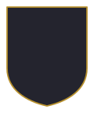<br/><sub>Traditional English</sub></td>
    <td align="center" valign="top">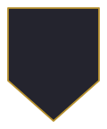<br/><sub>Pointed Heraldic</sub></td>
    <td align="center" valign="top">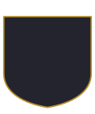<br/><sub>Wide Heater</sub></td>
    <td align="center" valign="top">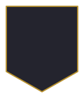<br/><sub>Chevron Bottom</sub></td>
    <td align="center" valign="top">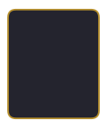<br/><sub>Rounded Rectangle</sub></td>
  </tr>
  <tr>
    <td align="center" valign="top">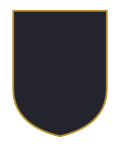<br/><sub>Classic</sub></td>
    <td align="center" valign="top">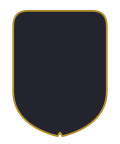<br/><sub>Notched Corners</sub></td>
    <td align="center" valign="top">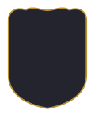<br/><sub>Ornate Top</sub></td>
    <td align="center" valign="top">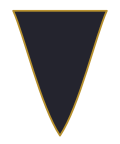<br/><sub>Waisted</sub></td>
    <td align="center" valign="top">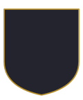<br/><sub>Wide</sub></td>
  </tr>
  <tr>
    <td align="center" valign="top">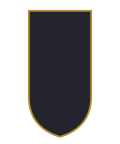<br/><sub>Tall</sub></td>
    <td align="center" valign="top">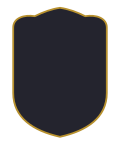<br/><sub>Arch Top</sub></td>
    <td align="center" valign="top">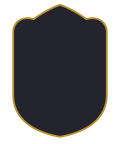<br/><sub>Gothic Arch</sub></td>
    <td align="center" valign="top">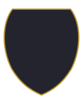<br/><sub>Barrel</sub></td>
    <td align="center" valign="top">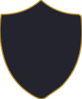<br/><sub>Pointed Arch</sub></td>
  </tr>
  <tr>
    <td align="center" valign="top">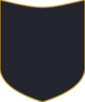<br/><sub>Cat Ear</sub></td>
    <td align="center" valign="top">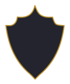<br/><sub>Crown Notch</sub></td>
    <td align="center" valign="top">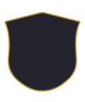<br/><sub>Rounded Banner</sub></td>
    <td align="center" valign="top">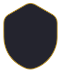<br/><sub>Round Heater</sub></td>
    <td align="center" valign="top">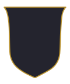<br/><sub>Flat Top</sub></td>
  </tr>
  <tr>
    <td align="center" valign="top"><br/><sub>Ornate Emblem</sub></td>
    <td align="center" valign="top">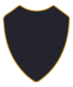<br/><sub>Dished</sub></td>
    <td align="center" valign="top">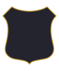<br/><sub>Cartouche</sub></td>
    <td align="center" valign="top">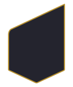<br/><sub>Kite</sub></td>
    <td align="center" valign="top">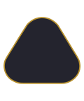<br/><sub>Rounded Triangle</sub></td>
  </tr>
  <tr>
    <td align="center" valign="top">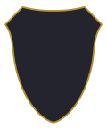<br/><sub>Flared</sub></td>
    <td align="center" valign="top">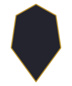<br/><sub>Gem</sub></td>
    <td align="center" valign="top">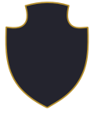<br/><sub>Eared</sub></td>
    <td align="center" valign="top">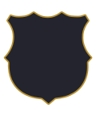<br/><sub>Scalloped</sub></td>
    <td align="center" valign="top">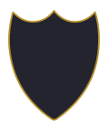<br/><sub>Fluted Crest</sub></td>
  </tr>
  <tr>
    <td align="center" valign="top">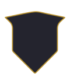<br/><sub>Banner Kite</sub></td>
    <td align="center" valign="top">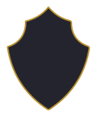<br/><sub>Regal Crest</sub></td>
    <td align="center" valign="top">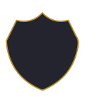<br/><sub>Double Arch</sub></td>
    <td align="center" valign="top">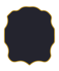<br/><sub>Baroque</sub></td>
    <td align="center" valign="top">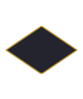<br/><sub>Lozenge</sub></td>
  </tr>
  <tr>
    <td align="center" valign="top">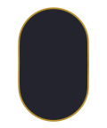<br/><sub>Capsule</sub></td>
    <td align="center" valign="top">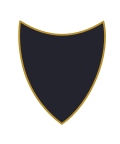<br/><sub>Spade</sub></td>
    <td align="center" valign="top">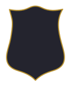<br/><sub>Scrolled</sub></td>
    <td align="center" valign="top">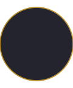<br/><sub>Circle</sub></td>
    <td align="center" valign="top">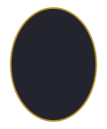<br/><sub>Oval Portrait</sub></td>
  </tr>
  <tr>
    <td align="center" valign="top">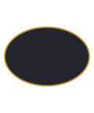<br/><sub>Oval Landscape</sub></td>
    <td align="center" valign="top">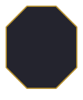<br/><sub>Octagonal</sub></td>
    <td align="center" valign="top">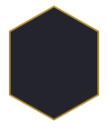<br/><sub>Hexagonal</sub></td>
    <td align="center" valign="top">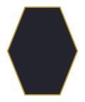<br/><sub>Flat Hexagon</sub></td>
    <td align="center" valign="top">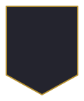<br/><sub>Pennant</sub></td>
  </tr>
  <tr>
    <td align="center" valign="top">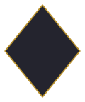<br/><sub>Diamond</sub></td>
    <td align="center" valign="top"><br/><sub>Starburst</sub></td>
  </tr>
</table>

---

## Export

**Print- & merch-ready, instantly.** Every export leaves Crest Foundry ready to go straight to a sticker press, embroidery digitizer, or apparel printer — no design-shop round-trip, no missing-font surprises. Design it here, download it, hand it to a print or merch shop as-is.

Three one-click actions from the badge toolbar (PNG, SVG, and **⧉ Copy** to clipboard); all have a fully transparent background outside the shield.

- **⬇ PNG** — high-resolution raster (~1600×1920, transparent). At 300 DPI that's roughly a 5×6″ print — ideal for **die-cut stickers, patches, and small apparel prints**. Fonts are embedded during rasterization, so text is always faithful.
- **⬇ SVG** — a self-contained vector file with **all text converted to outlines** ("Create Outlines"). No fonts are required to open or print it anywhere — glyphs are real `<path>` geometry, so it scales to any size and drops cleanly into Illustrator, Inkscape, or a print RIP. This is exactly the format a **print shop, vinyl cutter, or merch service** wants.
- **⧉ Copy** — the same clean, transparent PNG straight to your clipboard, ready to paste into Slack, a doc, or a merch-shop upload form.

Both downloaded files are named `crest-foundry-<club-name>.<ext>`.

**Handing it to a print/merch shop:** send the **SVG** for anything that needs to scale (banners, large apparel, vinyl/die-cut) — it's resolution-independent with no font dependencies. Send the **PNG** for quick sticker/patch runs or any service that only accepts raster. Because backgrounds are transparent, the crest drops onto shirts, mugs, and sticker stock without a white box around it.

**Auto-fit frame** — if a symbol or text element is placed outside the 200×240 badge bounds, the export **expands its frame** (viewBox + canvas) to include everything with a small margin, so nothing is clipped (PNG) or left off the artboard (SVG). Designs that stay within bounds export at the usual 200×240.

**How it works & gotchas learned**

- **Fonts in exports:** a standalone SVG (rasterized via `` for PNG, or opened as a file) does **not** inherit the page's web fonts. PNG embeds each used font as a subsetted base64 `@font-face`; SVG outlines the glyphs instead (via [opentype.js](https://github.com/opentypejs/opentype.js), lazy-loaded only on export).
- **Glyph outlining** reads **WOFF v1** font files from [Fontsource](https://fontsource.org/) (jsDelivr) — real per-weight files, so **bold** stays bold. (Google serves WOFF2, which opentype.js can't read; the `wawoff2` decompressor **hangs in-browser under Vite**, so we avoid it entirely.) Glyph *placement* — including text on an arc — comes from the browser's own `getStartPositionOfChar` / `getRotationOfChar`.
- **`paint-order` & Illustrator:** symbols paint their stroke *behind* the fill (`paint-order="stroke fill"`) so only a thin outer outline shows. Illustrator ignores `paint-order` and paints the stroke centered on top, reading ~2× thicker. The SVG export **flattens `paint-order`** into explicit draw order (stroke-only path behind, fill-only path on top) so strokes match the editor in every viewer.
- **Illustrator clip warning:** opening the SVG may show *"Clipping will be lost on roundtrip to Tiny"* — this is a **benign** SVG-Tiny-profile caution about the shield `<clipPath>`. The art imports fully, with clipping applied as a normal Illustrator clip mask.

> _Text stroke and a print-grade vector PDF (bleed/margins) are possible future additions._

---

## Accounts & Cloud

Sign-in is **optional** — the app is fully usable anonymously, with designs kept in the browser. Signing in unlocks cloud save and cross-device sync.

- **Passwordless auth** — social sign-in with **Google, GitHub, Discord, or Slack** (OAuth), or an **email magic link**, all handled by [Supabase Auth](https://supabase.com/auth). No passwords stored.
- **Cloud designs** — saved crests live in a Postgres `designs` table, guarded by **Row-Level Security** so you only ever see your own.
- **One-time import** — the first time you sign in, any designs saved locally in that browser are migrated into your account (idempotent — no duplicates on re-runs).
- **Graceful degradation** — with no Supabase config present, the app silently falls back to local-only mode.

## Sharing

Share a saved crest with anyone via an **unguessable, link-only** URL (`?c=<token>`).

- **Read-only view** — recipients (no account needed) see the crest on the same animated backdrop as the editor, which they can **browse/re-pick**, with the crest's palette tinting the scene.
- **Download & Remix** — viewers can grab the **PNG/SVG** or **Remix** the crest, which loads it into their own editor as a fresh design.
- **Security** — links resolve through a `SECURITY DEFINER` Postgres function that returns only the one matching crest, so shared designs are never enumerable and owner identity is never exposed. Sharing can be **revoked** at any time.

---

## Stack

- **Vue 3** + **Vite** (no TypeScript)
- **Plain scoped CSS** — no utility framework
- **opentype.js** — SVG-export text→outline (lazy-loaded only on export)
- **Supabase** — Postgres + Auth + Row-Level Security for accounts, cloud save, and link-only sharing (`@supabase/supabase-js`; anonymous/local-only when unconfigured)
- **Netlify** — static hosting + CI from GitHub (`VITE_SUPABASE_URL` / `VITE_SUPABASE_ANON_KEY` set as build env vars)

> _A public browse gallery and per-crest social preview images are possible future additions._

---

## Project Structure

```
src/
  components/
    BadgeComposer.vue       # SVG renderer + drag handling
    IconPicker.vue          # Symbol gallery
    TextEditor.vue          # Text element list + controls
    SnapshotPanel.vue       # Save/load/share snapshots (cloud or local)
    SaveModal.vue           # Save / update-in-place dialog
    ShareModal.vue          # Share-link dialog (copy / revoke)
    SharedView.vue          # Read-only view for a shared crest (?c=<token>)
    AuthModal.vue           # Sign-in (Google + email magic link)
    BackgroundPicker.vue    # Scene-background gallery + tone/overlay controls
    AppBackground.vue       # Animated page backdrop
    AboutModal.vue          # About / credits / Terms & Privacy links
  composables/
    useBadgeConfig.js       # All reactive badge state + mutations
    useAuth.js              # Supabase auth/session (singleton)
    useToast.js             # Toast queue
  data/
    clubs.js                # Real club color palettes
    icons.js                # heraldic SVG symbols (many imported from game-icons.net)
    shapes.js               # Shield shape path definitions
    backgrounds.js          # Scene-background option list (shared: editor + shared view)
  lib/
    supabase.js             # Supabase client (gated on env; null when unconfigured)
  utils/
    snapshots.js            # Save/load/delete/share designs (Supabase or localStorage)
    exportBadge.js          # PNG + SVG export
    arcPath.js              # SVG arc path generator for text
    patterns.js, bokeh.js, particles.js   # Backdrop + spark effects
  App.vue
  style.css
supabase/
  migrations/               # designs table + RLS, dedup, sharing RPC
public/
  terms.html, privacy.html  # static legal pages (linked from the About dialog)
scripts/
  import-game-icons.mjs     # Authoring tool: import icons from game-icons.net into icons.js
designs/                    # Saved badge screenshots
```

---

## Getting Started

```bash
npm install
npm run dev
```

The app runs anonymously (local-only) out of the box. To enable accounts, cloud save, and sharing, copy `.env.example` to `.env` and add your Supabase project's URL and publishable (anon) key:

```bash
cp .env.example .env
# VITE_SUPABASE_URL=...        VITE_SUPABASE_ANON_KEY=...
```

Then apply the SQL in `supabase/migrations/` (dashboard SQL Editor), and add your dev/prod origins to Supabase → Auth → URL Configuration (and your OAuth provider's origins).

---

## Keyboard Shortcuts

| Key | Action |
|---|---|
| Space | Randomize badge |
| Arrow keys | Nudge selected symbol or text (1px) |
| Shift + Arrow | Nudge 10px |
| Cmd/Ctrl + C | Copy selected symbol or text |
| Cmd/Ctrl + V | Paste copied element |
| Cmd/Ctrl + S | Save snapshot |
| Escape | Deselect |
| Delete / Backspace | Remove selected element |

---

## Credits

Many heraldic symbols are imported from [game-icons.net](https://game-icons.net), licensed under [CC BY 3.0](https://creativecommons.org/licenses/by/3.0/). Authors: carl-olsen, caro-asercion, delapouite, lorc, sbed, skoll, and sparker. These are also credited in-app via the ⓘ About dialog. Icons are pulled in with `scripts/import-game-icons.mjs` (a build-time authoring tool, not a runtime dependency).
